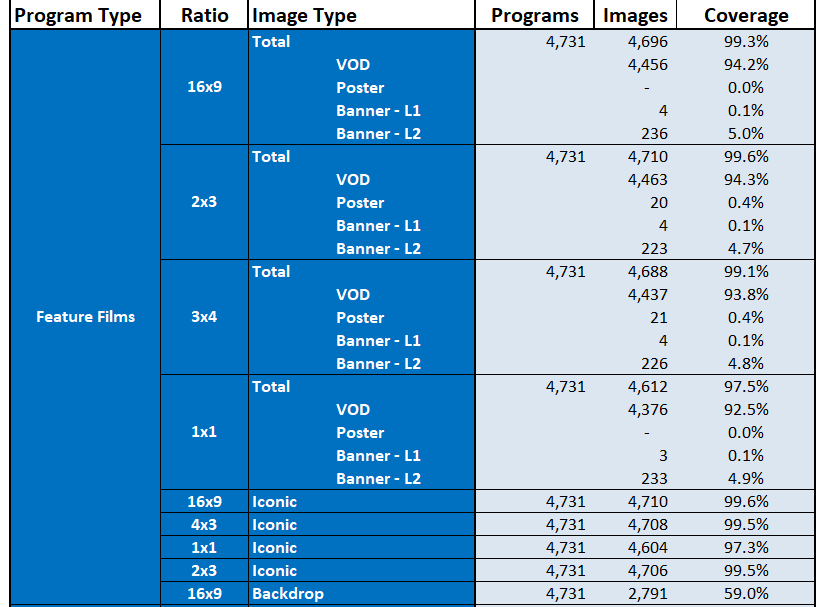

# Documentation Exclusions: Image Coverage Reports

> For standard Image Coverage reports, it is common to exclude certain programmes by default. These exclusions are made in order to ensure that the report output matches up with the product file, which also excludes these programmes by default.
> 
> Clients may, on a per-report basis, request exceptions to these exclusions.

## Standard Exclusions

-   **Exclude AO Programming (Adults Only Target Audience)**
    - Any programmes with a target audience of "Adults Only" should be excluded by default.
-   **Exclude Paid Programs**
    - Paid programs (for example, infomercials) should be excluded by default.
-   **Exclude Local Programming (Source Type = Local)**
    - Anything considered as "local programming" (any small, regional programs) with a source type of `Local` should be excluded by default.

> NOTE: We use **subtypes**, not types, to differentiate.

## Subtype Requirements

> Certain data types require certain parameters (usually a particular data subtype or a TMS ID prefix), and on top of this, we may also need to exclude particular genres for certain program types.

---

|   **Program Type Buckets**   |  **DB Program Subtype**   |  **Genre**   |
| --- | --- | --- |
|  ***Feature Film***    |  Feature Film    |   -  |
|   ***TV Movies/Short Film***   |  TV Movie OR Short Film    |   -  |
|    ***Series***  |   Series OR Miniseries   |  Exclude Genre: "News" OR "Talk"    |
|   ***Episodes***  |   Series OR Miniseries **AND** TMS ID begins "EP"  |   Exclude Genre: "News" OR "Talk Show" OR "Soap Opera" OR "Educational" OR "Game Show"  |
|  ***Special***   |    Special |  -   |
|   ***Sport***  |  Sport Event OR Sports Event OR Sports Non-Event **AND** TMS ID begins "SH" OR "EP" OR "SP"   |  -   |

## Scripted vs. Non-Scripted Series

There are two types of series:

- Scripted
- Non-Scripted

---  

| **Type** | **DB Program Subtype** | **Genre** |
| --- | --- | --- |
| **Scripted Series** | Series OR Miniseries **AND** TMS ID begins "SH" | **Any of the following genres (OR logic)**:   Action Adventure Comedy Drama Crime Drama Dark Comedy Documentary Drama Fantasy Historical Drama Horror Musical Comedy Reality Romantic Comedy Science Fiction Sitcom Soap Opera Teleroman Thriller Western   |
| **Scripted Episodes** | Series OR Miniseries **AND** TMS ID begins "EP"  | **Any of the following genres (OR logic)**:   Action Adventure Comedy Drama Crime Drama Dark Comedy Documentary Drama Fantasy Historical Drama Horror Musical Comedy Reality Romantic Comedy Science Fiction Sitcom Soap Opera Teleroman Thriller Western | 
| **Non-Scripted Series** | Series OR Miniseries **AND** TMS ID begins "SH" | **All other genres *not* in list above**   |
| **Non-Scripted Episodes** | Series OR Miniseries **AND** TMS ID begins "EP"  | **All other genres _not_ in list above** | 

## Coverage report example

> Here is an example of part of an image coverage report:

As we can see, it begins with the **subtype** (`Feature Film`) and then proceeds to break it down by **image ratio** (`16x9`, `2x3`, etc) and finally by **image type** (you can see from the screenshot that it is possible for each ratio to contain more than one image type, such as `VOD`, `Poster`, `Banner L1`, etc).

Next to that, we can see the image coverage.

- For example, there are a _total_ of **4,731** programs in the `16x9` `Feature Film` category.
- Of these, we can see that **4,696** of these programs have images.
- Therefore, the coverage is 99.3%.

This is broken down further so that we can check coverage per **image type**:
- Of these 4,731 programs:
    -  4,456 have VOD images (94.2%)
    - 0 have Poster images (0%)
    - 4 have a Banner L1 image (0.1%)
    - 236 have a Banner L2 image (5.0%)

## Image Ratios and Sizes

| **Ratio**	|	**Size**				|
| --- | --- |
| 16x9	|	`1280 x 720` or `1920 x 1080`		|		
| 2x3	|	`480 x 720` or `960 x 1440`			|	
| 3x4	|	`1080 x 1440` or `1536 x 2048`    (VOD and Poster Art)		|		

 
